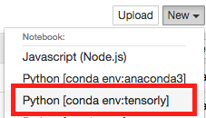

# This package is now deprecated.

Use [the official tensorly package instead](https://anaconda.org/conda-forge/tensorly). ([See also](https://anaconda.org/tensorly/repo?type=conda&label=main))

[TensorLy GitHub page](https://github.com/tensorly/tensorly) 

[TensorLy project page](http://tensorly.org/stable/index.html)

# Install tensorly with conda

**Warning:** These instructions were only tested on Mac OS X. Modifications of these instructions may be necessary for other platforms. If these instructions don't work for you, please raise an issue in the Github repository.

## Method 1: From scratch, no virtual environment

Download this repository somewhere onto your computer. Then, in the terminal, change your present working directory to be the location where you downloaded this repository.

Now run:

```
conda-build tensorly
```

This should (ideally) build locally a package named `tensorly` using the files in the `tensorly` directory included in this repository (the `meta.yml` file in that directory is what specifies that the package's name will be `tensorly`).

If the above does not fail, then it will be possible to complete the installation with the following command:

```
conda install --use-local tensorly
```

## Method 2: From scratch, with virtual environment

This method is recommended over method 1, since it helps to isolate, control, and avoid issues arising due to incompatible changes in newer versions of tensorly's dependencies, as well as due to incompatible changes in newer versions of `conda` or `conda-build`.

As before, download this repository somewhere onto your computer. Then, in the terminal, change your present working directory to be the location where you downloaded this repository.

Run the following to create a conda virtual environment named `tensorly`:

```
conda env create -f environment.yml
```

This creates the `tensorly` virtual environment based on the YAML file included in the repository (`environment.yml`).

Now run the following command in the terminal:


```
source activate tensorly
```

This will switch the active virtual environment to be the `tensorly` virtual environment created above.

Now follow the instructions for Method 1 to complete the installation.

(*Note:* To leave the `tensorly` virtual environment after installing the `tensorly` package, enter the command `source deactivate`.)

## Method 3: From a channel, no virtual environment

While building the package from scratch, it was easy for me to subsequently upload the built package to Anaconda cloud. Therefore running the following command should (theoretically) accomplish exactly the same as Method 1:


```
conda install -c krinsman tensorly
```

The `-c` flag alerts conda to use the non-standard channel `krinsman`, [where this package is found](https://anaconda.org/krinsman/tensorly).

## Method 4: From a channel, with virtual environment

These instructions are exactly the same as Method 2, except that the last step is to follow the instructions of Method 3, rather than the instructions of Method 1.

To be more explicit, after changing into the correct present working directory in the terminal, one should run the following commands:


```
conda env create -f environment.yml
source activate tensorly
conda install -c krinsman tensorly
```

(*Note:* To leave the `tensorly` virtual environment after installing the `tensorly` package, enter the command `source deactivate`.)

# Getting Started

An ideal way to start familiarizing oneself with tensorly's features is to use [the introductory Jupyter notebooks uploaded by the developer](https://github.com/JeanKossaifi/tensorly-notebooks).

If your installation of `conda` came with the Anaconda distribution, then you should already have Jupyter notebook on your computer. Otherwise (e.g. if you installed Miniconda), then first run:


```
conda install jupyter
```

You should then have Jupyter Notebook installed on your system.

## Methods 1 and 3

If you installed successfully using either Method 1 or Method 3, then you will have tensorly installed in your root virtual environment, and therefore should be able to run your own versions of the [introductory notebooks from the developer](https://github.com/JeanKossaifi/tensorly-notebooks) without further issue (assuming you run them using the root virtual environment).

## Methods 2 and 4

If you installed (successfully) using either Method 2 or Method 4, then you will not have tensorly installed in your root virtual environment, but only in the `tensorly` virtual environment. Therefore, in order to be able to run your own versions of [the developer's notebooks](https://github.com/JeanKossaifi/tensorly-notebooks), you will need to first ensure that Jupyter Notebook is running a Python kernel in the `tensorly` environment. The `tensorly` environment by default also includes the `nb_conda` extension to Jupyter Notebook which allows one to specify the virtual environment in which the notebook will be run when creating a notebook.

First, open Jupyter Notebook inside of the virtual environment:


```
source activate tensorly
jupyter notebook
```

(The first line is necessary unless you have already installed the `nb_conda` extension in your root virtual environment.) Then when clicking "New" to create a new notebook, select the "Python [conda env:tensorly]" option (see the picture below for an example of what this might look like). Then it should be possible to run [the developer's notebooks](https://github.com/JeanKossaifi/tensorly-notebooks).


